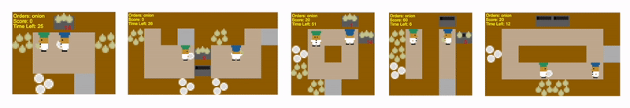

# Policy Graphs and Intention: answering ’why’ and ’how’ from a telic perspective

Gimenez-Abalos V., Alvarez-Napagao S., Tormos A., Cortes U., Vazquez-Salceda J. _Policy Graphs and Intention: answering ’why’ and ’how’ from a telic perspective_. In Proceedings of the 24rd International Conference on Autonomous Agents and Multiagent Systems (AAMAS '25). 

Check the [webpage](https://hpai-bsc.github.io/intention-aware-pgs/) for explanations on what this does!

The slides used to present this in EXTRAAMAS are in the file named Slides.


> Agents are a special kind of AI-based software in that they interact in complex environments and have increased potential for emergent behaviour. Explaining such behaviour is key to deploying trustworthy AI, but the increasing complexity and opaque nature of many agent implementations makes this hard. In this work, we reuse the Policy Graphs method –which can be used to explain opaque agent behaviour– and enhance it to query it with hypotheses of desirable situations. These hypotheses are used to compute a numerical value to examine agent intentions at any particular moment, as a function of how likely the agent is to bring about a hypothesised desirable situation. We emphasise the relevance of how this approach has full epistemic traceability, and each belief used by the algorithms providing answers is backed by specific facts from its construction process. We show the numeric approach provides a robust and intuitive way to provide telic explainability (explaining current actions from the perspective of bringing about situations), and allows to evaluate the interpretability of behaviour of the agent based on the explanations; and it opens the door to explainability that is useful not only to the human, but to an agent.

Included in this repository is a code for reproducing paper results, as well as more experimental results for other layouts, more 
analysed trajectories, etc.

## Setup
For basic reproduction of results, installation requires a pip install of requirements. Instructions for MAC below.

Two auxiliary codes (extract_trajectories, generate_pgs) are included to illustrate how those two artefacts are
generated, but require further requirements than those in requirements.txt ; and are not necessary to reproduce
paper results

## Paper reproduction and experiments

`src/eval/reproduce.py` contains the code for reproducing all experiments in the paper in order. Run from root-level
working directory (not src).

In addition to reproducing results, the setup allows to test in 3 more layouts:


From left to right: simple, random1, random3, unident_s, and random0. Only simple and random0 are used in the
paper due to space constraints exclusively.

When analysing results, we remark that unident_s for the HPPO agent does NOT work.

### Agent internal naming

Agents in this repository are referenced in the following manner:
HPPO:D14
PPO1:D24
HAg: D34
PPO2:D44
RAg: DR4

## Mac install

```bash
brew install graphviz
pip install --no-cache-dir --use-pep517 \ 
  --config-settings="--global-option=build_ext" \
  --config-settings="--global-option=-I$(brew --prefix graphviz)/include/" \
  --config-settings="--global-option=-L$(brew --prefix graphviz)/lib/" \
  pygraphviz
```

## Cite as

```
@inproceedings{gimenez_intention_aware_2025,
    author = {Gimenez-Abalos, Victor and Alvarez-Napagao, Sergio and Tormos, Adrian and Cortés, Ulises and Vázquez-Salceda, Javier},
    title = {Policy Graphs and Intention: answering ‘why’ and ‘how’ from a telic perspective},
    year = {2025},
    isbn = {},
    publisher = {International Foundation for Autonomous Agents and Multiagent Systems},
    address = {Richland, SC},
    abstract = {},
    booktitle = {Proceedings of the 24rd International Conference on Autonomous Agents and Multiagent Systems},
    pages = {},
    numpages = {},
    keywords = {},
    location = {Detroit, United States of America},
    series = {AAMAS '25}
}
```
