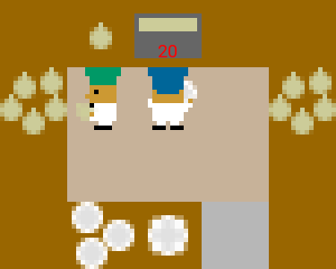

---
title: ""
feature_image: "https://picsum.photos/id/88/1280/?blur=3"
feature_text: |
  ## Policy Graphs and Intention: answering ’why’ and ’how’ from a telic perspective
  Victor Gimenez-Abalos<sup>*1</sup>, Sergio Alvarez-Napagao<sup>1,2</sup>, Adrián Tormos<sup>1</sup>, <br> Ulises Cortés<sup>1,2</sup>, Javier Vazquez-Salceda<sup>1</sup>
  <small>
    <br>
    <sup>*</sup>Corresponding author <victor.gimenez@bsc.es>
    <br>
    <sup>1</sup>Barcelona Supercomputing Center
    <br>
    <sup>2</sup>Universitat Politècnica de Catalunya
  </small>
  
--- 


     

# Abstract

> Agents are a special kind of AI-based software in that they interact in complex environments and have increased potential for emergent behaviour. 
Explaining such behaviour is key to deploying trustworthy AI, but the increasing complexity and opaque nature of many agent implementations makes this hard. 
In this work, we reuse the Policy Graphs method --which can be used to explain opaque agent behaviour-- and enhance it to query it with hypotheses of desirable situations. These hypotheses are used to compute a numerical value to examine agent intentions at any particular moment, as a function of how likely the agent is to bring about a hypothesised desirable situation. We emphasise the relevance of how this approach has full epistemic traceability, and each belief used by the algorithms providing answers is backed by specific facts from its construction process.
We show the numeric approach provides a robust and intuitive way
to provide telic explainability (explaining current actions from the perspective of bringing about situations), and allows to evaluate the interpretability of behaviour of the agent based on the explanations; and it opens the door to explainability that is useful not only to the human, but to an agent.

# Video explanation

<iframe width="502" height="282" src="https://www.youtube.com/embed/FOZkfVnE3vA" title="pgs" frameborder="0" allow="accelerometer; autoplay; clipboard-write; encrypted-media; gyroscope; picture-in-picture; web-share" referrerpolicy="strict-origin-when-cross-origin" allowfullscreen></iframe>

# Motivating example
Consider the following scenario. You are watching a chef work in the kitchen. He toils away at the cutting board,
prepares ingredients over the counter-top... until you see him fill a cooking pot with water. You surmise that it will
take part in the recipe, possibly to boil water and do something with it. You ask the chef: Why did you feel that pot?
Befuddlingly, he responds:

> Because the hob was unused, and the pot was empty.

This kind of responses are a staple of explainable agency. Especially when working with explaining opaque agents, or
coming up with agent-agnostic methods, explainable agency focuses on which elements of the current state seem
to be relevant for the action (in this case, filling the pot). Rather than illuminate the explainee, it leaves them 
confused. Instead, what he'd have expected would be something akin to:

> Because I am going to cook pasta.

We humans are able to attribute that sort of intentionality easily, simply via observation: without the need to ask, by
simply observing the counter top and locating the dry pasta, we could have arrived at the same conclusion. Moreso, the
task of cooking pasta, albeit desirable (who doesn't love some good carbonara), is not the sole reason of existence of
the cook: therefore, when doing this attribution, we would be hypothesising that such seems desirable and is going to 
happen. 

We should also take into consideration that, even if such a desire or goal existed, there may be things (such as)
the building catching fire) that would result in the desire not being fulfilled. Hence, it would be nice to also know 
how much intention is there behind the actions: will he stop making pasta if he gets a phone call that a friend is 
bringing take-out? Has he already cooked some spoilables, and hence is determined to use them despite the call?

With these questions in mind, we want a model that, like humans, is capable of attributing intentions, and can be used
to reference desires, milestones, goals, etc. that an explainee will understand as part of their outcome. When we have
these intentions, we will be able to reply to questions like:

* What do you intend to do now? _I intend to boil water, cook pasta, and serve a plate of carbonara._
* Why are you filling the pot with water? _I need it to boil water._
* How are you going to boil water? _I will place the pot with water on the hob, turn it on, then go back to chopping the 
guanciale. By the time I end, the water will be boiling._

## Intention Policy Graphs (IPG)

IPGs are a simple model for understanding telic (that is, long-term) agent behaviour. The gist is: if an explainee would 
understand that an agent acts to achieve something apparently desirable, then providing responses that summarise behaviour
as 'bringing about' such achievement can explain actions. 

Rather than assume that the agent tracks these desirable things, we approach it from an architecture-agnostic perspective:
What is needed to know if agent behaviour will bring about some desirable state? Motivated by folk-psychology, we
consider the eponymous intentions, which are the result of the desire to achieve something together with a belief it can
be attained.

In this work, we operationalise intention as the probability that a desire be fulfilled in the future of a given state.
We use Policy Graphs (PG) as a model to estimate probabilities of actions and transitions (P(s'|a,s), P(a|s)) such that
we can compute the probability of any trajectory culminating on a desirable transition in the graph, for any possible
state: for a desire _d_, and a state _s_, there is an intention _I_d(s)_ (which follows axioms of probability).

### Evaluation, metrics, and XAI

In order to evaluate that an intention occurs, we impose a commitment threshold _C_ as the minimum intention that a state
needs in order to say that an intention is _attributed_ to the agent in a state. 
This doubles as a trade-of between interpretability and reliability. At higher _C_, the explainee is skeptic 
toward explanations, intentions are less often attributed (and hence part of answers to explainability), but they are
more frequently intentions that come to be fulfilled.

We use this intention to answer questions such as: 
* What does the agent intend to do at state _s_? Any intention that is _attributed_ in _s_ (<i>I<sub>d</sub>(s)>C</i>).
* Why would it do _a_ at _s_? The intentions attributed in _s_ that are expected to increase by using _a_
* How would the agent fulfill _d_ from _s_? A plausible sequence of actions and states the PG believes will occur such 
that _d_ is brought about, starting at _s_.

<div class="grid">
    <div class="col-1">
        <div class="screenshot">
            
        </div>
    </div>
    <div class="col-2">
        <p class="results-text">
            ‣ What does it intend to do?
            <br>
            <span class="results-text indented">Desire to <span style="color: #5A5AA2"><b>SERVE SOUP</b></span>: <span class="desire-moderate"><b>0.625</b></span></span>
            <br><br>
            ‣ Why would it <span style="color: #4A6551"><b>INTERACT</b></span>?
            <br>
            <span class="results-text indented">Intentions attributed for <span style="color: #5A5AA2"><b>SERVING SOUP</b></span></span><br><span class="results-text indented">expected to increase by <span class="desire-moderate"><b>0.05</b></span>.</span>
            <br><br>
            ‣ How would it fulfill its desire?
            <br>
            <span class="results-text indented">By performing the following chain of actions:</span>
            <span class="results-text indented"><span style="color: #4A6551"><b>INTERACT</b></span> → <span style="color: #d167a4"><b>DOWN</b></span> → <span style="color: #d167a4"><b>RIGHT</b></span></span><br><span class="results-text indented"> → <span style="color: #d167a4"><b>DOWN</b></span> → <span style="color: #4A6551"><b>INTERACT</b></span></span>
        </p>
    </div>
</div>

<div class="grid">
    <div class="col-1">
        <div class="screenshot">
            
        </div>
    </div>
    <div class="col-2">
        <p class="results-text">
            ‣ What does it intend to do?
            <br>
            <span class="results-text indented">Desire to <span style="color: #5A5AA2"><b>PUT ONION IN POT</b></span>: <span class="desire-low"><b>0.381</b></span></span>
            <br><br>
            ‣ Why would it <span style="color: #4A6551"><b>INTERACT</b></span>?
            <br>
            <span class="results-text indented">Intentions attributed for <span style="color: #5A5AA2"><b>PUTTING ONION IN</b></span></span><br><span class="results-text indented"><span style="color: #5A5AA2"><b>POT</b></span> expected to increase by <span class="desire-high"><b>0.31</b></span>.</span>
            <br><br>
            ‣ How would it fulfill its desire?
            <br>
            <span class="results-text indented">By performing the following chain of actions:</span>
            <br>
            <span class="results-text indented"><span style="color: #4A6551"><b>INTERACT</b></span> → <span style="color: #d167a4"><b>RIGHT</b> → </span><span style="color: #4A6551"><b>INTERACT</b></span></span>
        </p>
    </div>
</div>


### Cite as

```
@inproceedings{gimenez_intention_aware_2025,
author = {Gimenez-Abalos, Victor and Alvarez-Napagao, Sergio and Tormos, Adrian and Cortés, Ulises and Vázquez-Salceda, Javier},
title = {Policy Graphs and Intention: answering ‘why’ and ‘how’ from a telic perspective},
year = {2025},
isbn = {},
publisher = {International Foundation for Autonomous Agents and Multiagent Systems},
address = {Richland, SC},
abstract = {},
booktitle = {Proceedings of the 24rd International Conference on Autonomous Agents and Multiagent Systems},
pages = {},
numpages = {},
keywords = {},
location = {Detroit, United States of America},
series = {AAMAS '25}
}
```